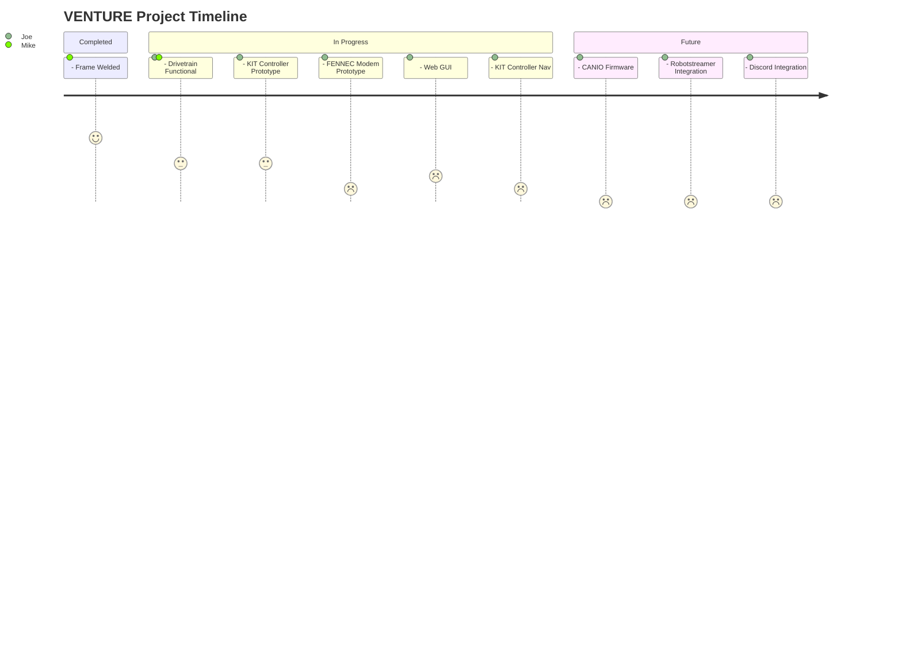

[](https://github.com/Kitsune-Robotics/VENTURE-1/actions/workflows/docs_workflow.yml)


# VENTURE-1




This repo contains all the firmware and hardware for the VENTURE-1.

If you're looking for the latest docs/builds, see our [Releases Page](https://github.com/Kitsune-Robotics/VENTURE-1/releases).

# Getting Started

First, clone this repo (and optionally checkout a branch)

```shell
git clone https://github.com/Kitsune-Robotics/VENTURE-1.git --recurse-submodules
cd VENTURE-1
```

# Init Submodules

Some libraries and resources are included as submodules, run the following
command to initialize them before opening the main sch

(If you get a missing library error, make sure to do this)

```shell
git submodule update --init --recursive
```


## Project Layout

If you want to use this project template for yourself, you can find it [here!](https://github.com/KenwoodFox/Project-Template)
